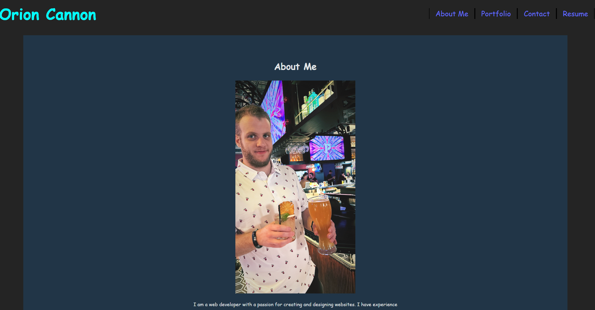

# Portfolio

## Description

This is the personal portfolio of Orion Cannon built using vite and react

## Table of Contents

- [Usage](#usage)
- [License](#license)
- [Contributing](#contributing)
- [Questions](#questions)

## Screenshot

## Usage

To learn all about Orion Cannon

## License

https://opensource.org/licenses/MIT

This project is licensed under the MIT License.

## Contributing

n/a

## Questions

If you have any questions about this project, you can reach me at orion.m.cannon@gmail.com
or you can find me on GitHub at [OrionC11](https://github.com/OrionC11).
